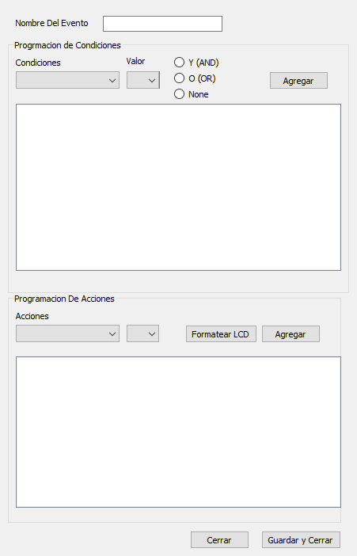

## ACTUALMENTE OBSOLETO

# InXource

En este proyecto se creo un pequeño IDE para programar los microcontroladores 18F4550

# Idea Principal

Crear una interfaz mediante la cual el usuario usando solo lenguaje coloquial puediera programar un microcontrolador con condiciones predefinidas para disparar distintos eventos.

Para poder llevarlo a cabo se realizo se realiza una conversion del pseudocodigo creador por la lista de eventos y acciones a codigo ANSI C, y posteriormente se realiza en forma automatica la compilacion (Preprocesing, Compilation, Assemble, Link) y posteriormente el codigo compilado se graba en el micrcontrolador usando el bootloader de https://pinguino.cc.
